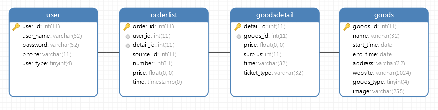

# 聚票网（Jupiter)

## 简介

聚票网是一个汇聚互联网上各种演出类门票的聚合平台。

Jupiter一名取自Jupiao-Net。

## 需求

### 功能

#### 用户

1. 注册与登录
2. 管理个人信息
3. 接受系统推送
4. 购买门票
5. 查询当前票务信息
6. 查询个人订单信息
7. 接受门票智能推荐
8. 评价交易
9. 竞拍票务

#### 管理员

1. 登录
2. 管理票务信息
3. 管理用户信息
4. 查看统计数据
5. 发布竞拍

### 实现流程

#### 用户注册

**基本流：**

1. 前端提示用户登录，用户输入用户名（不能重复）、密码、重复密码、手机号（不能重复），前端验证密码后向后端发送信息

2. 后端获取前端信息，在数据库中寻找是否存在相同用户名和手机号的用户，若存在，返回失败，若不存在，返回成功并将用户信息写入数据库

3. 前端接受信息，跳转至相应界面

**备选流：**

1. 存在相同用户名，提醒用户重新输入
2. 存在相同手机号，提醒用户找回密码

#### 用户登录

**基本流：**

1. 前端提示用户登录，用户输入用户名和密码，前端向后端发送信息

2. 后端获取前端信息，在数据库中寻找用户，并返回是否登录成功与用户类型

3. 前端接受信息，跳转至相应界面

**备选流：**

1. 登录失败，提醒用户登录失败
2. 登录失败次数超过3次，提醒用户找回密码

#### 用户购买

**基本流：**

1. 用户点击购买，向后端发送购买请求

2. 后端获取前端信息，在数据库中寻找写入订单信息，返回给前端订单号

3. 前端接受信息，展示订单号

**备选流：**

1. 用户未登录，提示用户登录

#### 用户查看订单

**基本流：**

1. 用户点击订单，向后端发送购买请求

2. 后端获取前端信息，在数据库中寻找订单信息，返回给前端订单号

3. 前端接受信息，展示订单

**备选流：**

1. 用户未登录，提示用户登录

## 技术实现要求

1. Web前端

   React 架构

2. 后端

   Spring

3. 数据库

   MySQL+ MongoDB

4. 开发工具

   1）IntellJ IDEA

   2）MySQL & MongoDB

## 数据库

商品：itemId，picture，name，place，time，price（different）(MongoDB），网址

用户：userId，username，password，phone，userType

订单：orderId，userId，ItemId，price，time，来源网站

## 计划表

1. 第一周安排：用户注册登录，信息收集，搜索（前后端结合）

|  No  |                  任务                  |                     要求                     |  日期   | 人员 | 完成 |
| :--: | :------------------------------------: | :------------------------------------------: | :-----: | :--: | :--: |
|  1   |           实现Web端user界面            |    登录注册，查看商品，搜索商品，查看订单    | 7.6~7.7 |  ck  |  Y   |
|  2   |          设计并实现数据库关系          |     画cdm，生成pdm，生成可用的数据库sql      | 7.6~7.7 | lsh  |  Y   |
|  3   |              初步实现爬虫              |                 爬取信息见上                 | 7.6~7.7 | dsy  |  Y   |
|  4   |              搭建后端框架              |                 分层架构实现                 | 7.6~7.7 | lhn  |  Y   |
|  5   |           实现Web端admin界面           | 编辑商品，编辑用户，查看所有订单（页面跳转） | 7.8~7.9 |  ck  |  Y   |
|  6   |     实现后端log功能，了解单元测试      |                                              | 7.8~7.9 | lhn  |  Y   |
|  7   | 实现爬虫数据向数据库写入，了解单元测试 |                                              | 7.8~7.9 | dsy  |  Y   |
|  8   |            编写票务详情界面            |                                              | 7.8~7.9 | lsh  |  Y   |
|  9   |           打通前端和后端交互           |                                              |         |      |      |
|  10  |             编写自动化测试             |                                              |         |      |      |
|  11  |                                        |                                              |         |      |      |
|      |                                        |                                              |         |      |      |
|      |                                        |                                              |         |      |      |

第二周安排：用户注册登录，信息收集，搜索（前后端结合）

|  No  |                任务                 |                        要求                        |  日期   | 人员 |
| :--: | :---------------------------------: | :------------------------------------------------: | :-----: | :--: |
|  1   |        完善用户信息相关界面         | 登录注册，查看商品，搜索商品，查看订单（页面跳转） | 7.6~7.7 |      |
|  2   |        实现更新用户信息功能         |                       三个表                       | 7.6~7.7 |      |
|  3   |     实现后端更新用户信息service     |                    爬取信息见上                    | 7.6~7.7 |      |
|  4   |        完善交易信息相关界面         |                                                    | 7.6~7.7 |      |
|  5   |        实现检索交易信息功能         |    编辑商品，编辑用户，查看所有订单（页面跳转）    |         |      |
|  6   |   完善后端交易信息的增删查service   |                        分层                        |         |      |
|  7   |   实现Web端管理员管理用户信息功能   |                                                    |         |      |
|  8   |    后端实现用户信息相关的service    |                                                    |         |      |
|  9   |     实现发布交易信息的初始界面      |                                                    |         |      |
|  10  |    实现发布交易信息的相关service    |                                                    |         |      |
|  11  | 与后台管理系统对接，提供相关service |                                                    |         |      |
|  12  |              集成测试               |                                                    |         |      |

第三周安排：用户注册登录，信息收集，搜索（前后端结合）

|  No  |          任务          |                        要求                        |  日期   | 人员 |
| :--: | :--------------------: | :------------------------------------------------: | :-----: | :--: |
|  1   | 实现用户详情的统计图表 | 登录注册，查看商品，搜索商品，查看订单（页面跳转） | 7.6~7.7 |      |
|  2   |  实现更新用户头像功能  |                       三个表                       | 7.6~7.7 |      |
|  3   |        压力测试        |                    爬取信息见上                    | 7.6~7.7 |      |
|      |                        |                                                    |         |      |
|      |                        |                                                    |         |      |
|      |                        |                                                    |         |      |
|      |                        |                                                    |         |      |
|      |                        |                                                    |         |      |
|      |                        |                                                    |         |      |
|      |                        |                                                    |         |      |
|      |                        |                                                    |         |      |
|      |                        |                                                    |         |      |